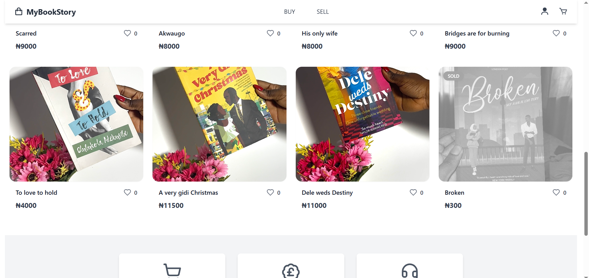

# MyBookStory
MyBookStory is a full-stack web application that allows users to browse, purchase, and track books. It’s built with secure online payment integration, personalized user experiences, and backend functionality that supports real-time order management.

**Link to project:** https://mybookstory.vercel.app/

## How It's Made:

**Tech used:** MERN, Payments: Paystack, Auth: JWT-based user authentication, Utilities: Axios, dotenv, crypto, CRON, PostMark

This project goes beyond just listing and selling books — it's designed with scalability, performance, and clean architecture in mind:

Secure Checkout Flow: Full integration with Paystack for initializing transactions, verifying payments, and handling webhook callbacks.
Order Management System: Seamless user experience with backend logic that manages order status (pending, paid), transaction references, and delivery info.
Confirmation Emails: Prepared for email notifications after successful purchases.
Modular Codebase: Organized controller/services structure for scalability and maintainability
Webhook Verification: Ensures only valid Paystack transactions are recorded, using HMAC SHA-512 signature checks.

This project is a great example of how to build a modern transactional backend API that interacts with third-party services, supports real users, and handles real-world ecommerce flow.

## Optimizations

Email & SMS Notifications: Improve post-purchase communication using SendGrid or Twilio.
Mobile Support: Responsive frontend or dedicated React Native app.
Advanced Search & Filters: Category-based browsing and full-text search capabilities.
Book Reviews and Ratings: Let users leave feedback and rate books.
Admin Dashboard: Add product management, sales analytics, and fulfillment controls.

## Lessons Learned:

Building MyBookStory was a hands-on exercise in integrating third-party payment systems, building secure and scalable REST APIs, and handling real-time webhooks. I also deepened my understanding of authentication flows, error handling, and the importance of environment-aware deployment setups.

## Examples:
Take a look at these couple examples that I have in my own portfolio:

**My Testimony:** https://mytestimony.vercel.app/

**Car-Check App:** https://car-check-iota.vercel.app/

**WeatherStory:** https://myweatherstory.onrender.com/

